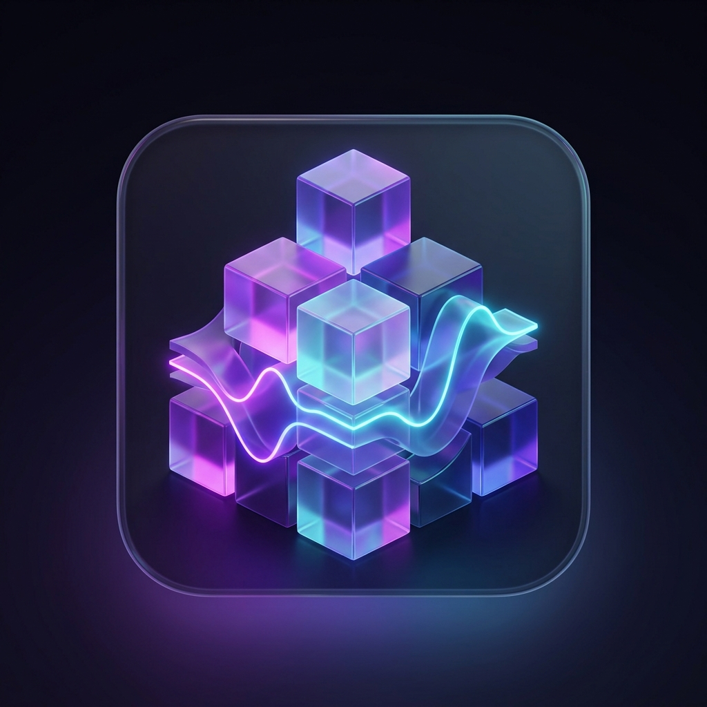

# Audioblox

<p align="center">
  
</p>

<p align="center">
  <strong>An open-source method for templating, testing, and deploying AI voice technology.</strong>
</p>

---

## Overview

**Audioblox** is a lightweight, high-performance developer framework designed to template, test, and deploy conversational voice applications. By bridging real-time text-streaming from Large Language Models (LLMs) with expressive Text-to-Speech (TTS) synthesis, Audioblox provides a zero-latency conversational playground optimized for voice agents, job interview preparation, roleplay practice, and customer support simulation.

The application features a developer-centric, **VSCode-inspired modular workspace** designed to help developers inspect system configurations, view styling properties, track average API latency, and monitor system debugger logs in real-time.

---

## Core Features

- ⚡ **Zero-Latency Streaming Engine**: Leverages HTTP Chunked text streaming and parallel sentence-level synthesis to drop start-of-speech latency to **~150ms-250ms**.
- 🛠️ **Developer Workspace (VSCode-Inspired)**:
  - **Left Sidebar**: Integrated File Explorer, Voice Actor selectors, Scenarios prompts, and connection settings.
  - **Right Sidebar**: Context details, session objective checklists, and dialogue turn metrics.
  - **Bottom Panel**: A scrollable debugger console printing color-coded streams from audio, speech, and server events.
  - **Live Code Tabs**: Syntax-highlighted views of the active `system_config.json` session parameters and `avatar_visualizer.css` styling properties.
- 🎭 **Roleplay Prompts & Scenarios**: Instant templates to test voice behavior under specialized scenarios (Hamlet script rehearsal, hiring manager interview, angry customer de-escalation).
- 🧠 **Smart Speech Caching**: In-memory FIFO cache for duplicate sentences to eliminate redundant synthesis API calls, maximizing speed.
- 🔊 **Expressive Native Voices**: Built-in compatibility with Google's native conversational voices (`Puck`, `Aoede`, `Charon`, `Kore`, `Fenrir`).

---

## Architecture

Audioblox splits the text-retrieval and speech-synthesis layers to achieve natural human conversation speed:

```
[User Speech/Input] 
        │
        ▼ (POST /chat)
[Gemini-2.5-Flash] ──(Stream Text Chunks)──► [Client Render Buffer]
                                                    │
                                          (Split into Sentences)
                                                    │
                                                    ▼ (POST /synthesize_wav)
                                             [TTS Parallel Cache]
                                                    │
                                                    ▼ (Enqueue & Play)
                                             [WAV Audio Output]
```

---

## Setup & Installation

### 1. Clone the Repository
```bash
git clone https://github.com/murderszn/audio-blocks.git
cd audio-blocks
```

### 2. Create a Virtual Environment and Install Dependencies
```bash
python -m venv venv
source venv/bin/activate  # On Windows: venv\Scripts\activate
pip install -r requirements.txt
```

### 3. Configure Environment Variables
Create a `.env` file in the project root:
```env
GOOGLE_API_KEY=your_gemini_api_key
```

### 4. Run the Application
```bash
python server.py
```

### 5. Access the Console
Open your web browser and navigate to:
👉 **`http://localhost:7777`**

---

## API Endpoints

- **`POST /init`**: Initializes a new session, binds the Gemini LLM client, and sets up session parameters.
- **`POST /chat`**: Receives prompt dialogue and returns text stream using Chunked Transfer Encoding.
- **`POST /synthesize_wav`**: Converts text sentences to high-quality WAV format (16-bit, 24kHz, mono).
- **`POST /synthesize_batch`**: Takes an array of text sentences, synthesizes in batch, and returns concatenated PCM audio.
- **`POST /settings`**: Dynamically updates active voice actor selection for the current session.

---

## License

This project is licensed under the MIT License - see the [LICENSE](file:///Users/jahflyx/audioblox/audio-blocks/LICENSE) file for details.